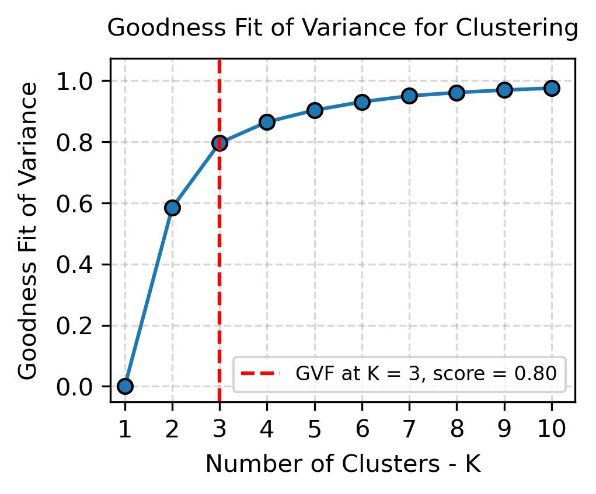
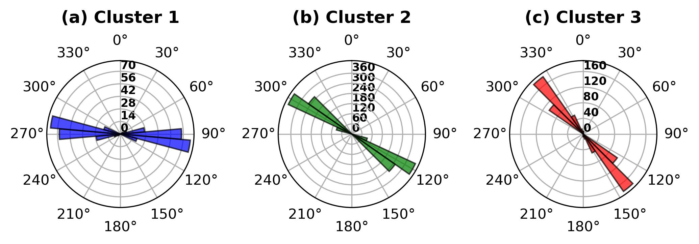

# Magnetometric Lineament Analysis: Ponta Grossa Arc Region

**Author**:  João Paulo G. R. Alves a  
**Date**: Feb-2025   
**Contact**: joao_gralves@hotmail.com

a *Institute of Energy and Environment, University of São Paulo (IEE-USP), São Paulo, 05508-010, Brazil*

---

## Overview
This project analyzes magnetometric lineaments in the Ponta Grossa Arc region of southern Brazil (spanning from Curitiba to Florianópolis). Using GIS and data science techniques in Python, we cluster the lineaments based on strike angle and correlate them to major tectonic events described in Riccomini’s (1995) thesis on post-Gondwana deformation in southeastern Brazil.

  

**Fig. 1**: Goodness of Variance Fit (GVF) plot for K=1..10. An “elbow” near K=3 indicates an optimal partitioning of the lineament strike data.

  

**Fig. 2**: Rose diagrams illustrating the directional frequency of lineaments in each cluster, highlighting predominant strike orientations.

---

## Motivation
- **Geological Importance**: The Ponta Grossa Arc is a key tectonic feature that records multiple reactivation events since the breakup of Gondwana.
- **Data Science**: This project highlights clustering (Jenks Natural Breaks), statistical tests (Shapiro–Wilk, Kruskal–Wallis, Dunn’s), geospatial processing (GeoPandas), and visualization (matplotlib, seaborn).

## Data Sources
- **Shapefile (database.shp)**: Contains lineaments (geometry + “Angle” attribute).  
- **Shapefile (boundary.shp)**: Regional boundary for map context.

## Methodology
1. **Import & Inspect Data**  
   - Load shapefiles as GeoDataFrames with GeoPandas.  
   - Verify coverage and attributes on a reference map.
2. **Angle Clustering**  
   - Compute breakpoints with **Jenks Natural Breaks**.  
   - Evaluate Goodness of Variance Fit (GVF).  
   - Select the optimal number of clusters (K=3).
3. **Statistical Validation**  
   - **Shapiro–Wilk** test confirms data are not normally distributed.  
   - **Kruskal–Wallis** & **Dunn’s** post-hoc confirm significant differences among clusters.
4. **Visualization**  
   - **Polar (Rose) Diagrams** to see distribution of strikes.  
   - **QQ-Plot** to check normality visually.  
   - **Box Plots** for each cluster to highlight dispersion and potential outliers.  
5. **Summary Statistics**  
   - Descriptive statistics (min, max, mean, quartiles, etc.), for each cluster.  

## Results
- **Identified Three Structural Sets**  
  - NW–SE / WNW–ESE  
  - ENE–WSW / E–W  
  - Possibly N–S or a variation near E–W  
- **Correlation with Riccomini (1995)**  
  - Matches known fault families and reactivation phases of the Ponta Grossa Arc.  
  - NW–SE often relates to Cretaceous magmatism (Serra Geral) and early Gondwana breakup.  
  - E–W or ENE–WSW sets may reflect later oblique reactivation events.

## Conclusions
- **Multi-phase Tectonic Reactivation**: The data confirm multiple pulses of faulting and magmatism.  
- **Clustering & Stats**: Combining Jenks, Kruskal–Wallis, and Dunn’s robustly shows distinct strike families.  
- **Enhanced Visualization**: QQ-plots and box plots help illustrate non-normal distributions and structural variability.

## Future Work
- Extending the analysis with gravity or seismic data to better define the depth and continuity of these structures.
- Comparing lineament patterns with known intrusions or local fault scarps to see if they coincide with field-mapped structures.  
- Clarify timing of reactivations or cross-cutting relationships.

## References

- Riccomini, C. (1995). Tectonismo gerador e deformador dos depósitos sedimentares pós-gondvânicos da porção centro-oriental do Estado de São Paulo e áreas vizinhas. Tese de Livre Docência, Instituto de Geociências, Universidade de São Paulo, São Paulo. doi:10.11606/T.44.2013.tde-03062013-103524. Recuperado em 2022-02-16, de www.teses.usp.br

## Getting the code

You can download a copy of all the files in this repository by cloning the
[git](https://git-scm.com/) repository:

    git clone https://github.com/jp-alves/LineamentsJNB.git

or [download a zip archive](https://github.com/jp-alves/LineamentsJNB/archive/master.zip).

After downloading, you can install the required dependencies with:

    pip install -r requirements.txt

## License

All source code is made available under a MIT license. You can freely use 
and modify the code, without warranty, so long as you provide attribution
to the authors. See 'LICENSE.md' for the full license text.

## Contact

For any questions or inquiries, please contact:
João Paulo G. R. Alves - [email](mailto:joao_gralves@hotmail.com)
